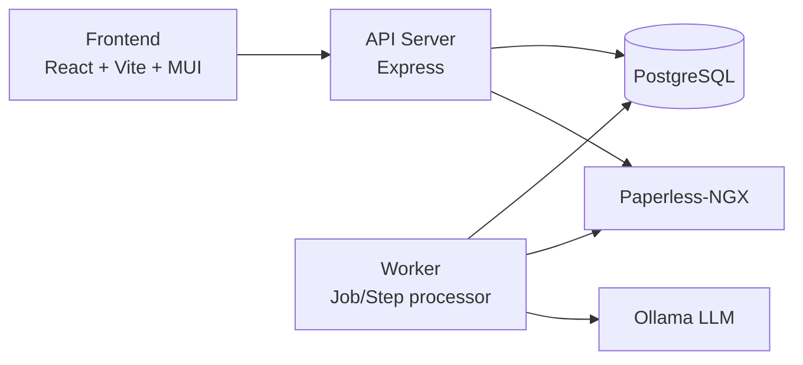

# Paperless-LLM

Paperless-LLM connects [Paperless-NGX](https://docs.paperless-ngx.com/) to a Large Language Model (via [Ollama](https://ollama.com)) so that newly scanned or imported documents can be given descriptive titles, tags, and other metadata automatically, instead of being left for someone to clean up by hand.

## Why

Existing solutions like paperless-ai and paperless-gpt were either slow or had difficult-to-use interfaces (e.g. paperless-gpt needed several minutes to load titles and only worked if the website was kept open).

Paperless-LLM sidesteps this by moving to an asynchronous model — all processing happens in the background, and the user simply accepts or rejects the resulting updates. It also provides better support for tag/document type/correspondent generation by allowing descriptions to be configured for each field value.

## Key Features

- **Field generation** — LLM-generated titles, tags, correspondents, creation dates, and document types based on document content
- **Customizable prompts** — prompt templates per step type are stored in the database and editable through the API/UI without a redeploy
- **Customizable field values** — add descriptions for each tag, correspondent, and document type to ensure documents are correctly matched
- **Paperless account support** — supports login through Paperless-NGX user credentials
- **Automated and approval workflows** — run fully automated, or require a human to review and approve/reject suggested changes before they're applied
- **Auto-queue** — periodically polls Paperless-NGX for documents with a configured tag and enqueues them automatically
- **Retry and fallout handling** — failed steps retry with exponential backoff; steps that exhaust their retries are surfaced as "fallouts" for inspection
- **Full audit trail** — every change applied to a document is recorded in an audit log, including old and new values

## Screenshots

<!-- TODO(#35): add screenshots / a short demo clip of the Jobs list, Job details, and Approvals UI. -->

## Architecture

The **API server** exposes a REST API for submitting jobs, monitoring queues, managing approvals, and editing prompts. The **worker** picks up pending steps, fetches document content from Paperless-NGX, sends it to Ollama for processing, and writes the results back to Paperless-NGX. Both processes share the same PostgreSQL database and can run combined in a single process for development, or as separate, independently scalable processes in production. The **frontend** is a React/Vite/MUI single-page app for monitoring jobs, queues, and pending approvals.

## Getting Started

📖 **[Full documentation](https://tifu.github.io/paperless-llm/latest/)** — architecture, configuration reference, and API/TypeDoc reference.

- [Quick Start](https://tifu.github.io/paperless-llm/latest/quick-start/) — get the API server, worker, and frontend running locally
- [Docker installation](https://tifu.github.io/paperless-llm/latest/installation/docker/) — production images via Docker
- [Helm installation](https://tifu.github.io/paperless-llm/latest/installation/helm/) — deploy to Kubernetes
- [Development setup](https://tifu.github.io/paperless-llm/latest/development/) — local dev environment with hot reload

## Contributing

Contributions are welcome — see [CONTRIBUTING.md](CONTRIBUTING.md).

## License

[GPL-3.0](LICENSE.md)
