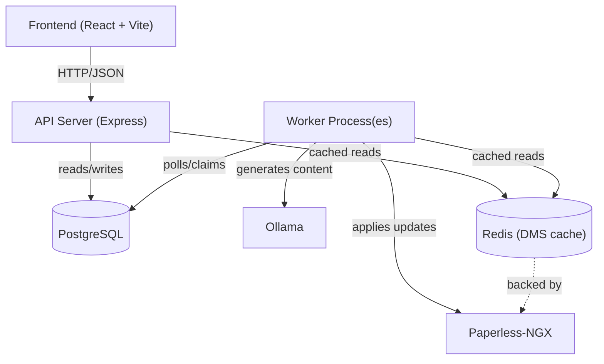
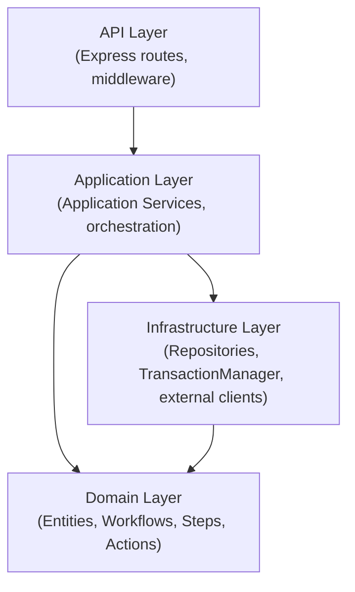
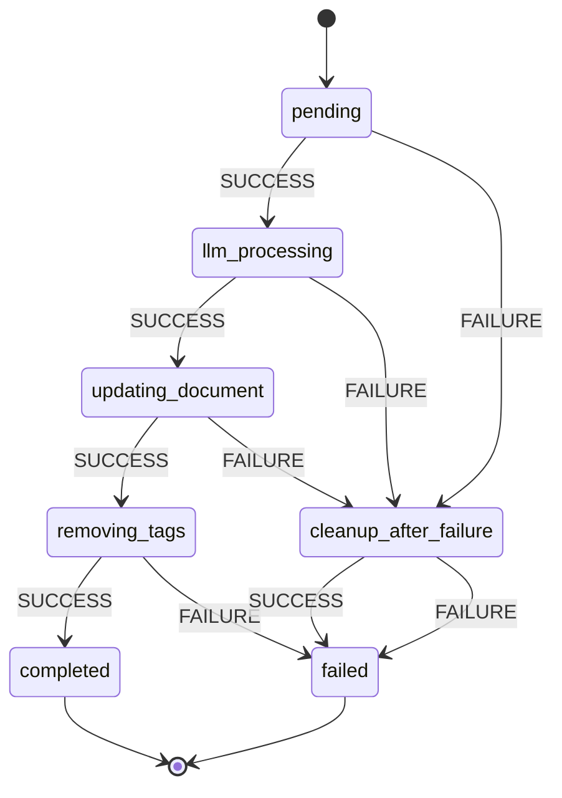
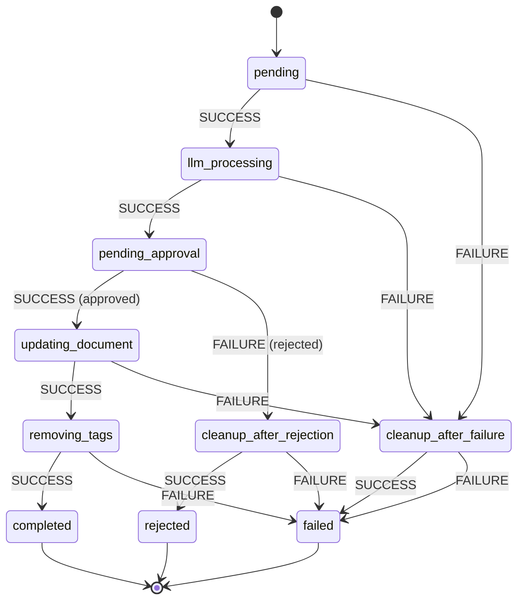
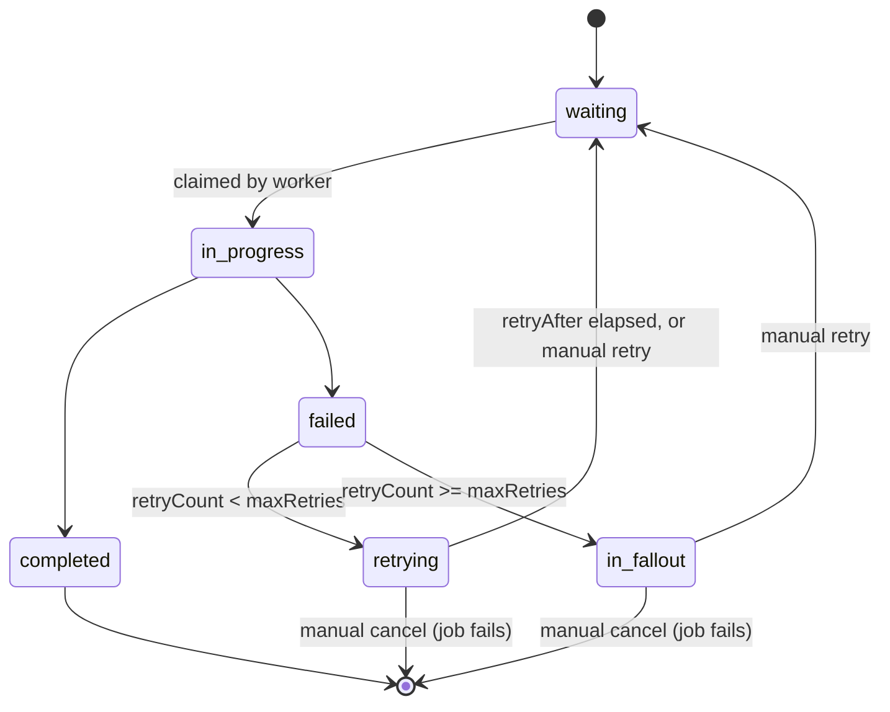

# Backend Architecture

Paperless-LLM's backend (`server/`) is a Domain-Driven Design (DDD) structured Express/TypeScript application that integrates Ollama with Paperless-NGX to automatically generate document titles, tags, correspondents, document types, and creation dates. It exposes a REST API and runs one or more background workers that poll a PostgreSQL-backed queue.

## Overview

The system has four moving parts: a frontend, an API server, one or more worker processes, and the external services they coordinate (PostgreSQL, Paperless-NGX, Ollama, and an optional Redis cache).



The API server and worker logic share a single codebase and bootstrap process (`server/src/bootstrap.ts`). They can run together in one Node.js process or as separate processes — see [Scaling, Performance & High Availability](#scaling-performance-high-availability).

### Project Structure

```
server/src/
├── api/              # Express routes, middleware (HTTP layer)
│   ├── routes/
│   └── middleware/
├── application/      # Application services (use-case orchestration)
│   └── util/
├── domain/           # Pure business logic (entities, workflows, steps, actions)
│   ├── job/
│   ├── steps/
│   ├── workflows/
│   ├── actions/
│   ├── prompt/
│   ├── document/
│   ├── llm/
│   ├── audit/
│   ├── auth/
│   ├── authorization/
│   ├── entityDescriptions/
│   ├── workerExecution/
│   ├── common/
│   └── services/
├── infrastructure/   # Database, transaction management, worker scheduling
├── repositories/      # Repository implementations
│   └── postgresql/
├── services/         # External service clients (Paperless, Ollama, cache)
├── map/              # Mapping between domain objects and DTOs
├── web/               # API-facing DTOs
│   └── dtos/
├── config/            # AppConfig (config.yaml loading and validation)
├── utils/             # Logger and other shared utilities
├── bootstrap.ts       # Shared startup: config, DB, migrations, services
├── runServer.ts       # API server entry point
├── runWorker.ts        # Worker process entry point
└── main.ts             # CLI entry point (--mode=server / --mode=worker)
```

This reflects the current source layout. Older internal notes describe a `worker/` directory and a generic `repositories/interfaces` split — the codebase has since consolidated around `server/src/` with `domain`, `application`, `infrastructure`, `repositories`, `services`, `api`, `web`, `map`, `config`, and `utils` as the top-level layers.

## Domain Model

The domain layer is built around a small set of cooperating concepts: a **Job** tracks a document's processing lifecycle, a **Workflow** defines what states and steps that lifecycle has, **Steps** are the executable units within a job, **Actions** are the document mutations a step proposes, and **Prompts** are the templates used to ask the LLM for content. A **Document** is the Paperless-NGX resource being acted on.

```
Document (in Paperless) → Job → Steps → Document Actions → Updated Document
                            │
                            ├── uses a Workflow (state transition rules)
                            └── steps use Prompts (LLM template + variables)
```

### Jobs

A `Job` (`server/src/domain/job/Job.ts`) represents one document-processing task. It tracks:

| Attribute | Description |
|---|---|
| `id` | Unique identifier |
| `documentId` | Paperless document ID |
| `state` | Current `JobState` |
| `workflowType` | `AUTOMATED` or `APPROVAL` (`server/src/domain/workflows/WorkflowType.ts`) |
| `fields` | Which document fields to generate (`title`, `tags`, `correspondent`, `document_type`, `created_date`) |
| `createdAt` / `updatedAt` | Lifecycle timestamps |

Jobs advance through a series of `JobState` values (`server/src/domain/job/JobState.ts`): `pending`, `llm_processing`, `pending_approval`, `updating_document`, `removing_tags`, `completed`, `failed`, `rejected`. The exact transitions are determined by the job's `Workflow` — see [Workflow Orchestration](#workflow-orchestration).

### Steps

A `Step` is an atomic unit of work belonging to a job (`server/src/domain/steps/IStep.ts`). Steps carry their own status independent of the job:

| Attribute | Description |
|---|---|
| `stepId` | Unique identifier |
| `jobId` | Parent job |
| `stepType` | `StepType` — what the step does |
| `stepState` | `StepStatus`: `waiting`, `in_progress`, `completed`, `failed`, `retrying`, `in_fallout` |
| `retryCount` / `retryAfter` | Retry bookkeeping |
| `parentStepId` | Set for child steps spawned by a composite step |

Step types include `LLM_GENERATE_TITLE`, `LLM_GENERATE_TAGS`, `LLM_GENERATE_CORRESPONDENT`, `LLM_GENERATE_DOCUMENT_TYPE`, `LLM_GENERATE_CREATED_DATE`, the composite `LLM_GENERATE_FIELDS` (which fans out into the per-field LLM steps a job actually requested), `REQUIRE_APPROVAL` (a manual/user-interaction step), `UPDATE_DOCUMENT`, and `REMOVE_TAGS`. Steps are `kind: "composite" | "manual" | "executable"` — composite steps spawn and track child steps, manual steps wait on a human (e.g. approval), and executable steps run autonomously and may call Ollama or Paperless.

Steps are designed to be idempotent: retried or re-claimed steps should produce the same outcome without double-applying side effects.

### Workflows

A `Workflow` (`server/src/domain/workflows/`) defines the state machine a job follows — which `JobState` follows another for a given transition result, and which `Step` to create for each state. Two implementations exist today, `AutomatedWorkflow` and `ApprovalWorkflow` (see [Workflow Orchestration](#workflow-orchestration) for their transition tables). The interface (`BaseWorkflow`/`IWorkflow`) is designed so additional workflow types can be added without touching job or step code.

### Actions

A `DocumentAction` (`server/src/domain/actions/DocumentAction.ts`) is a proposed mutation to a Paperless document, produced by an LLM-generation step and applied later by `UPDATE_DOCUMENT` or `REMOVE_TAGS`. Each action records both `oldValue` and `newValue`, which doubles as the audit trail for what changed. Action types (`DocumentActionType`, in `server/src/domain/actions/ActionType.ts`): `update_title`, `update_tags`, `update_correspondent`, `update_document_type`, `update_created_date`, `remove_tags`. Each action also declares a `fieldType` (`string`, `tag`, `correspondent`, `document_type`, `date`) and whether its value `isMultiple`, which the frontend uses to render the right editor control during approval review.

### Prompts

A `Prompt` (`server/src/domain/prompt/Prompt.ts`) is a versioned template used to build an LLM request for a given step type. It has a `stepType`, a `template` string containing `{{variable}}` placeholders, and a `version` that increments whenever the template is edited. See Configuration > Prompt Customization for how to edit these and how variable substitution works — this page only covers the entity shape.

### Document

A `Document` represents a Paperless-NGX document. Documents are never stored in the Paperless-LLM database — they're fetched and updated live through `IDocumentManagementSystem`, optionally through a caching adapter (`CachedPaperlessServiceAdapter`) backed by Redis.

### Relationships

```
Document (external, in Paperless)
      │ 1:N
      ▼
    Job ── uses ──> Workflow
      │ 1:N
      ▼
   Step ── may reference ──> Prompt
      │ 1:N
      ▼
DocumentAction
```

- One Document can have many Jobs over time.
- One Job has exactly one Workflow (determined by `workflowType`) and many sequential Steps.
- One Step may use one Prompt (for LLM-generation steps) and can produce many DocumentActions.
- DocumentActions are consumed by later steps (`UPDATE_DOCUMENT`, `REMOVE_TAGS`) in the same job.

For the literal SQL schema (columns, indexes, foreign keys) for the `jobs`, `steps`, `document_actions`, and `prompts` tables, see the Schema Overview section of the migrations README (`server/README.md`) rather than this page.

## DDD Layers & Transaction Boundaries

The codebase is organized into three layers with one-way dependency rules, plus a thin API layer on top.



**Allowed dependencies:** API → Application, Application → Domain, Application → Infrastructure, Infrastructure → Domain (via interfaces).

**Forbidden dependencies:** Domain → Application, Domain → Infrastructure, Infrastructure → Application.

### Domain layer (`server/src/domain/`)

Pure business logic with no framework or I/O dependencies: no database access, no HTTP calls, no `await` on infrastructure. Entities (`Job`, `Step` implementations, `DocumentAction` implementations, `Prompt`) encapsulate business rules; value objects and enums (`JobState`, `StepType`, `StepStatus`, `DocumentActionType`) are immutable; domain services (workflow classes, `PromptDomainService`) hold stateless domain operations; interfaces (`IDocumentManagementSystem`, `ILLMService`, repository interfaces) define contracts that infrastructure must satisfy. This keeps domain logic trivially unit-testable and decoupled from Postgres, Express, or any specific LLM provider.

### Application layer (`server/src/application/`)

Orchestrates domain operations and coordinates with infrastructure: application services such as `StepExecutorApplicationService`, `JobApplicationService`, `ApprovalApplicationService`, `QueueApplicationService`, `StepRetryApplicationService`, and `StuckStepResetApplicationService`, wired together by `ApplicationServiceFactory`. This layer owns transaction boundaries, retrieves and persists domain objects, talks to external services, and handles/logs errors.

### Infrastructure layer (`server/src/infrastructure/`, `server/src/repositories/`, `server/src/services/`)

Handles persistence, transaction lifecycle, and external communication: PostgreSQL repository implementations, `TransactionManager`/unit-of-work plumbing (`UoW.ts`), the generic `WorkerExecutor` poller, and external service clients (`PaperlessService`, `OllamaService`, the Redis-backed `CacheService`).

### Transaction boundaries

**Principle:** external API calls happen *outside* transactions, since they cannot be rolled back; database writes happen *inside* short transactions to keep consistency without holding connections open.

Consider the naive approach:

```typescript
// BAD: external call inside a transaction
await using context = await txManager.createContext();
context.start();
const title = await llmService.generateTitle(content); // holds the DB connection for seconds
await repos.steps.update(step);
context.commit();
```

This blocks other workers and wastes pool connections for as long as Ollama takes to respond. The fix is to fetch what's needed, call the external service with no transaction open, then persist the result in a fresh, short transaction:

```typescript
// GOOD: external call outside the transaction
await using context1 = await txManager.createContext();
context1.start();
const step = await repos.steps.findById(stepId);
const doc = await repos.documents.findById(step.documentId);
context1.commit();

const title = await llmService.generateTitle(doc.content); // no DB connection held

await using context2 = await txManager.createContext();
context2.start();
step.markCompleted();
await repos.steps.update(step);
context2.commit();
```

All repository access requires an active transaction context obtained from the transaction manager/unit-of-work factory — there is no implicit auto-commit. This is deliberate: it makes transactional scope explicit and visible at every call site, gives type-safe repository access bound to the active context, and makes concurrency easier to reason about, at the cost of slightly more verbose call sites than an ORM with implicit sessions would require.

External services are abstracted behind domain interfaces (`IDocumentManagementSystem`, `ILLMService`), which keeps the application layer testable and makes the LLM/DMS backends swappable in principle, and external calls are idempotent where possible (document updates overwrite rather than increment; step execution short-circuits if the step is already completed), so retries are safe.

### Adding new step types or workflows

Following DDD discipline when extending the system: new step types live in `server/src/domain/steps/`, implement the step's `execute()`-equivalent contract, and are wired into `StepFactory`; new workflows live in `server/src/domain/workflows/`, implement the workflow interface, and define their own transition table. Domain code added this way stays free of database or HTTP calls — orchestration and persistence belong in the application and infrastructure layers, not in the entity itself.

## Workflow Orchestration

### State machine

Jobs move through `JobState` values under the control of their `Workflow`. The two workflow implementations that exist today are `AutomatedWorkflow` and `ApprovalWorkflow`; both are driven by the same step-execution and transition machinery (`Transition`, `TransitionMap`, `BaseWorkflow`), just with different transition tables.

#### AutomatedWorkflow

Fully automated processing, no human gate:



Step mapping: `llm_processing` creates a composite `LLM_GENERATE_FIELDS` step (which fans out into the per-field LLM steps the job actually requested — title, tags, correspondent, document type, created date); `updating_document` creates `UPDATE_DOCUMENT`; `removing_tags` and `cleanup_after_failure` both create `REMOVE_TAGS` — clearing the trigger tag whether the job is about to succeed or fail, so a failed job's document isn't immediately re-picked-up by Auto-Queue. `removing_tags` itself failing is left going straight to `failed` (already an attempted cleanup — routing it through another cleanup state would just loop).

#### ApprovalWorkflow

Adds a manual approval gate between LLM generation and applying changes:



Step mapping is identical to `AutomatedWorkflow` except `pending_approval` creates a `REQUIRE_APPROVAL` step — a manual step that blocks until a user approves or rejects the proposed `DocumentAction`s via the API/frontend. A rejection routes through `cleanup_after_rejection` (also a `REMOVE_TAGS` step) before reaching `rejected`, for the same reason as `cleanup_after_failure` above: without it, the just-rejected document would still carry its trigger tag and Auto-Queue would recreate the job on its next pass.

Both workflows share `REMOVE_TAGS` as the step behind `removing_tags`, `cleanup_after_failure`, and (for approval) `cleanup_after_rejection` — every path off the happy path still ends with the trigger tag removed. `completed`, `failed`, and (for approval) `rejected` are the only true terminal states; the `cleanup_after_*` states are ordinary non-terminal steps that just happen to sit right before one.

### Progression flow

When a step finishes, the application layer asks the job's workflow for the next state given the transition result, persists the new job state, and — if the new state is non-terminal — creates the next step for that state. Job and step changes are persisted together so a job is never left pointing at a state with no corresponding step.

## Queue System

Paperless-LLM uses PostgreSQL itself as the work queue rather than a dedicated message broker (Bull, RabbitMQ, SQS). Steps live in the `steps` table with a `status` column (`waiting`, `in_progress`, `completed`, `failed`, `retrying`, `in_fallout`); workers claim batches of `waiting` steps using row-level locking, execute them, and update their status — all without any inter-worker coordination protocol beyond the database itself.

**Advantages:** single source of truth, transactional consistency between queue state and business data, no additional infrastructure to operate, full SQL query power for inspecting the queue.

**Trade-offs:** higher database load than an in-memory broker, polling-driven latency (seconds, not milliseconds), and throughput bounded by what Postgres can sustain for claim/update churn — acceptable for this system's expected document-processing volumes.

### Polling model

Rather than a single hard-coded "LLM cycle" and "document-update cycle," the backend uses one generic poller class, `WorkerExecutor` (`server/src/infrastructure/WorkerExecutor.ts`), instantiated multiple times with different work functions and intervals. Each instance:

1. Schedules its next run with `setTimeout`, not a tight loop.
2. Measures how long the previous run took and subtracts that from the configured interval before scheduling the next run, keeping a consistent rhythm under load (adaptive timing) rather than drifting.
3. Records its own start/success/failure in the `worker_executions` / `worker_execution_items` tables via short-lived system units of work, independent of whatever transaction the actual work used — so worker activity is itself observable through the API (see `WorkerExecutionsPage` in the frontend).

`runWorker.ts` wires up the actual pollers running in a worker process:

| Worker | What it does | Interval source |
|---|---|---|
| `step_processor` | Claims and executes `waiting` steps in batches, then moves due `retrying` steps back to `waiting` | `workers.stepExecution.pollIntervalMs` |
| `stuck_step_reset` | Finds steps stuck `in_progress` past a timeout and fails or retries them | `workers.stuckStepReset.checkIntervalMs` |
| `entity_sync` | Periodically syncs Paperless entity metadata (tags, correspondents, document types) used for descriptions | `workers.entitySync.pollIntervalMs` |
| `document_auto_queue` | Optional: watches Paperless for documents tagged for auto-processing and creates jobs for them | `workers.autoQueue.pollIntervalMs` (only runs if `workers.autoQueue.enabled`) |

Multiple worker processes can run these pollers concurrently — each claims a non-overlapping batch via row-level locking, and there is no leader election or explicit worker-to-worker coordination required.

## Retry & Error Handling

### Automatic retry

When a step fails, `IStep.markExecutionFailed()` increments its retry count and, if under the configured maximum, moves it to `retrying` with an exponentially increasing `retryAfter` timestamp (`retryDelayInMs * retryExponent^retryCount`). Once the limit is exceeded, the step moves to `in_fallout` instead, which blocks the job at that state until a human intervenes.

### Step status lifecycle



Every failure goes through an automatic retry decision first: `failed --> retrying` if attempts remain, `failed --> in_fallout` only once `retryCount` has already exceeded `maxRetries`. A step never skips straight from `failed` to a human-facing dead end on its own — `in_fallout` is reached only after the automatic retries are exhausted, and even then it isn't terminal by itself: a human must either retry it (back to `waiting`) or cancel it (terminal failure). The `step_processor` worker's retry pass moves `retrying` steps whose `retryAfter` has elapsed back to `waiting` automatically; manual retry does the same thing on demand, before the timer would otherwise fire.

### Stuck step detection

Steps can get stuck `in_progress` if a worker process crashes or hangs mid-execution. `StuckStepResetApplicationService`, run by the `stuck_step_reset` poller, periodically finds steps that have been `in_progress` longer than `workers.stuckStepReset.timeoutMs` and resets them — either back into the retry cycle or straight to `in_fallout`, depending on how many attempts remain — so a single crashed worker can't permanently wedge a job.

### Manual intervention

Steps in `in_fallout` require manual action through the API (and the frontend's Fallouts page):

- `POST /api/steps/:stepId/retry` resets the step to `waiting` (`retryCount` back to 0) for re-execution.
- `POST /api/steps/:stepId/cancel` marks the step failed and advances the job to its terminal failed state.

### Retry configuration

Retry behavior is currently uniform across all step types, configured globally under `retry` in `config.yaml` (`maxRetries`, `retryDelayInMs`, `retryExponent`). This is simpler to operate and reason about than per-step-type policies, at the cost of not being able to tune, say, LLM-generation retries differently from document-update retries.

## Scaling, Performance & High Availability

### Horizontal worker scaling

Because the queue lives in PostgreSQL and claims use row-level locking, horizontal scaling is just "run more worker processes" — there's no shared in-memory state to coordinate, no leader election, and no sticky routing. Each `step_processor` instance independently claims a batch of `waiting` steps; Postgres guarantees no two workers claim the same row. This is why the all-in-one vs. separate-workers deployment split (described in the installation guides) exists at all: splitting workers out of the API process lets you scale worker replica count independently of API replica count, and isolate worker resource usage (CPU/memory spent rendering prompts, waiting on Ollama, talking to Paperless) from the API's request-handling resources.

The trade-off of database-as-queue is that scaling workers also scales load on PostgreSQL — every claim, status update, and retry check is a query. Throughput is ultimately bounded by what the database can sustain for that churn, not by worker count alone, which is why connection pooling and database tuning matter more here than they would with an external broker absorbing that load.

### Vertical scaling

Within a single worker instance, throughput can be tuned via `workers.stepExecution.batchSize` (more steps claimed per poll cycle) and `workers.stepExecution.pollIntervalMs` (shorter intervals mean lower latency but more frequent queries). These two knobs trade database load against processing latency directly — a larger batch size amortizes per-poll overhead but increases the time a single claim transaction holds locks; a shorter poll interval reduces the time documents sit `waiting` but increases query volume against the `steps` table.

### Database scaling considerations

Because PostgreSQL is both the system of record and the queue, its connection pool is a shared resource between API request handling and every worker poller. Read replicas can offload reporting-style queries (e.g. dashboard stats, audit log browsing) without competing with the write-heavy claim/update traffic on the primary, and partitioning becomes relevant once the `steps` or `document_actions` tables grow large enough that index maintenance or vacuum overhead becomes noticeable — neither is needed at small scale, but both are available levers as job volume grows.

### High availability

High availability for this system has two largely independent dimensions: the API tier and the worker tier. The API tier is stateless per-request (aside from the JWT-based auth context), so running multiple API replicas behind a load balancer with health checks is enough to tolerate individual instance failure — there's no session affinity to worry about. The worker tier is HA almost by construction: because workers coordinate purely through database row locks rather than through each other, losing a worker process mid-step does not corrupt state — the stuck-step detector will eventually notice the abandoned `in_progress` step and recover it, and any other running worker can pick up newly `waiting` work immediately.

The dimension that genuinely needs deliberate HA design is PostgreSQL itself, since both the API and every worker depend on it being reachable: a primary/replica setup with automated failover removes it as a single point of failure, and synchronous replication is the option that trades a little write latency for not losing committed jobs/steps if the primary fails. Because Paperless-LLM treats the database as its queue as well as its system of record, database downtime stops both new job intake and all in-flight step processing — there's no buffering tier in front of it to ride out an outage, which makes database HA more load-bearing here than it would be in an architecture with a separate message broker.

## Key Design Decisions

### Polling vs. message queue

**Decision:** poll PostgreSQL instead of running a dedicated message broker (Bull, RabbitMQ, SQS).

**Rationale:** a single source of truth shared with the business data, transactional consistency between queue state and domain state, no extra infrastructure to deploy or operate, and throughput that comfortably covers expected document-processing volumes.

**Trade-off:** higher database load and second-scale latency rather than millisecond-scale latency — acceptable given documents are processed in the background, not on a user-facing request path.

### Step-based workflow decomposition

**Decision:** break each job into discrete, idempotent steps rather than executing a job as one monolithic operation.

**Rationale:** clear pause/resume boundaries (e.g. waiting for approval), independent retry per step instead of re-running an entire job on any failure, a step-level audit trail, and steps that are testable in isolation.

### External-then-transactional pattern

**Decision:** always call Ollama/Paperless outside of a database transaction, and persist results in a separate, short transaction.

**Rationale:** prevents long-held database connections while waiting on slow external calls, allows other workers to keep processing concurrently, and isolates external-service failures from database transaction state.

**Consequence:** requires external operations to be safely retryable/idempotent, since a crash between the external call and the follow-up transaction means the step will be retried.

### Explicit transaction context

**Decision:** require an explicitly created and started transaction context for any repository access — no implicit auto-commit.

**Rationale:** transactional scope is visible at every call site, repository access is type-safe and bound to the active context, and concurrent behavior is easier to reason about than with an ORM that begins/commits transactions implicitly.

### Generic worker poller reused across job types

**Decision:** implement one `WorkerExecutor` class with adaptive timing and self-recording execution history, and instantiate it per worker responsibility (step processing, stuck-step recovery, entity sync, document auto-queue) rather than writing bespoke polling loops for each.

**Rationale:** consistent operational behavior (timing, error handling, observability via `worker_executions`) across very different background jobs, and new periodic workers can be added by supplying a work function and an interval rather than reimplementing scheduling.

### Uniform retry configuration

**Decision:** apply one global retry policy (`maxRetries`, `retryDelayInMs`, `retryExponent`) across all step types rather than per-step-type policies.

**Rationale:** simpler configuration surface and consistent, predictable backoff behavior system-wide.

**Possible future direction:** per-step-type retry configuration, if different step types (e.g. LLM calls vs. document updates) turn out to need meaningfully different retry tuning.
