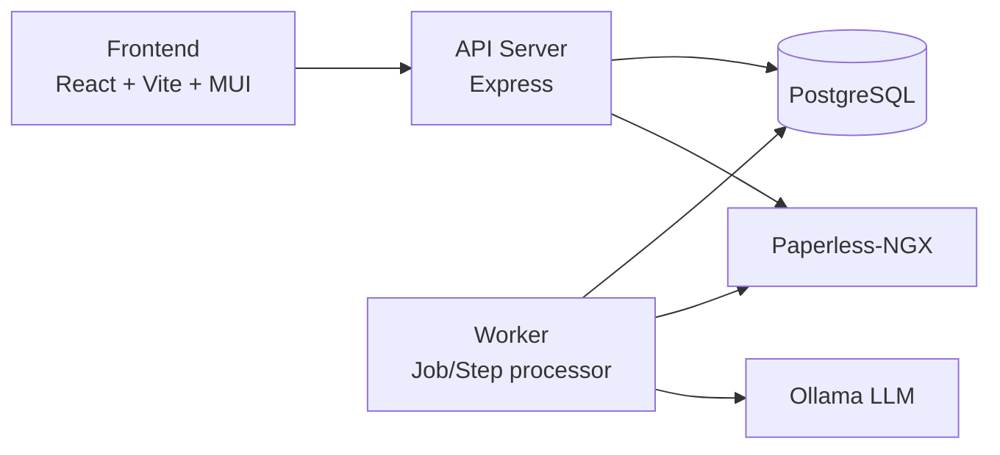

# Paperless-LLM

Paperless-LLM connects [Paperless-NGX](https://docs.paperless-ngx.com/) to a Large Language Model (via [Ollama](https://ollama.com)) so that newly scanned or imported documents can be given descriptive titles, tags, and other metadata automatically, instead of being left for someone to clean up by hand.

## Why

The existing solutions with paperless-ai and paperless-gpt both where either slow or had difficult to use interfaces (e.g., paperless-gpt needed several minutes to load the titles and only worked if the website was kept open). 

This, paperless-llm sidesteps by moving to an asynchronous model. All processing is done in the backgroud and the user can simply accept/reject updates. 

Additionally, paperless-llm provides better support for tag/document type/correspondent generation by allowing descriptions to be configured for each field value. 

## Key Features

- **Field generation** — LLM-generated titles, tags, correspondents, creation dates, and document types based on document content
- **Customizable prompts** — prompt templates per step type are stored in the database and editable through the API/UI without a redeploy
- **Customizable field values** - Add descriptions for each tag, correspondent, document type to ensure documents are correctly matched
- **Paperless Account Support** - Supports login through paperless user credentials
- **Automated and approval workflows** — run fully automated, or require a human to review and approve/reject suggested changes before they're applied
- **Auto-queue** — periodically polls Paperless-NGX for documents with a configured tag and enqueues them automatically
- **Retry and fallout handling** — failed steps retry with exponential backoff; steps that exhaust their retries are surfaced as "fallouts" for inspection
- **Full audit trail** — every change applied to a document is recorded in an audit log, including the old and new values

## Architecture

The **API server** exposes a REST API for submitting jobs, monitoring queues, managing approvals, and editing prompts. The **worker** picks up pending steps, fetches document content from Paperless-NGX, sends it to Ollama for processing, and writes the resulting `document_actions` back to Paperless-NGX. Both processes share the same PostgreSQL database, which stores `jobs`, `steps`, `document_actions`, `prompts`, and `audit_log` — server and worker can run combined in a single process for development or as separate, independently scalable processes in production. The **frontend** is a React/Vite/MUI single-page app for monitoring jobs, queues, and pending approvals.

## Getting Started

The fastest way to get a local instance running end-to-end is the [Quick Start](quick-start.md) guide.
